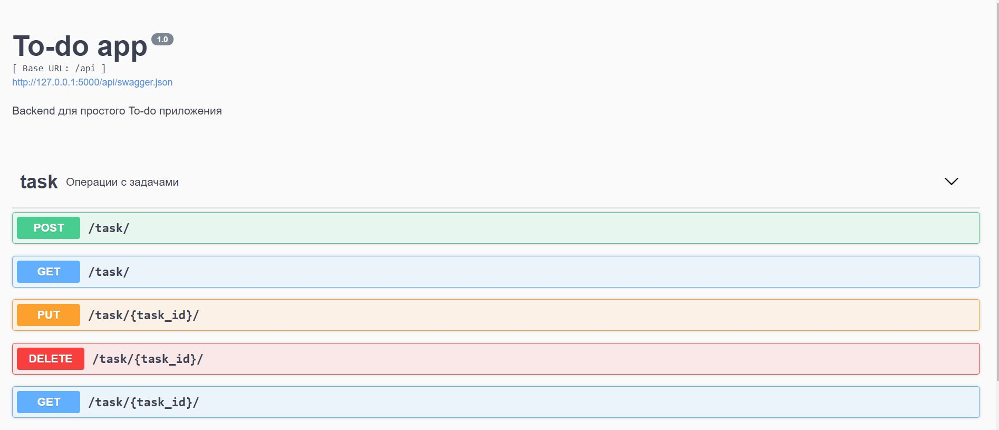

## Backend для простого To Do приложения с использованием [Flask](https://flask.palletsprojects.com/), [Flask-RESTPlus](https://flask-restplus.readthedocs.io/en/stable/index.html) и [peewee](http://docs.peewee-orm.com/)

---

Проект реализует собой REST api для работы со списком задач.
Функциональные возможности:
* Создание задачи
* Получение списка задач
* Получение детальной задачи
* Изменение задачи
* Удаление задачи


## Установка необходимых зависимостей

```
pip install flask
pip install flask-restplus
pip install peewee

```

## Кроме того, необходимо понизить версию для flask и Werkzeug:

```
pip install --upgrade flask==1.1.4
pip install --upgrade Werkzeug==0.16.1
```

## Запуск приложения

```
python app.py

```

Это запустит проект на порте 5000

## Swagger

Пример работы сваггера.


Сервер стартует на <http://localhost:5000>.

## Тестирование приложения

```
python api_tests.py
```
